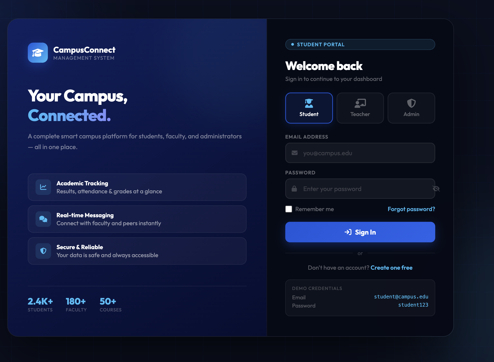
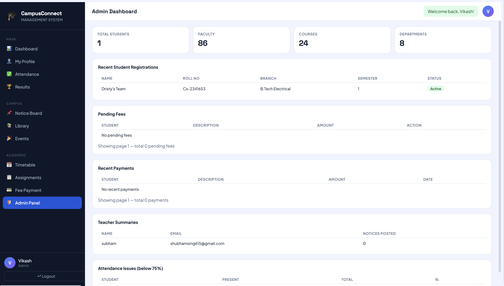
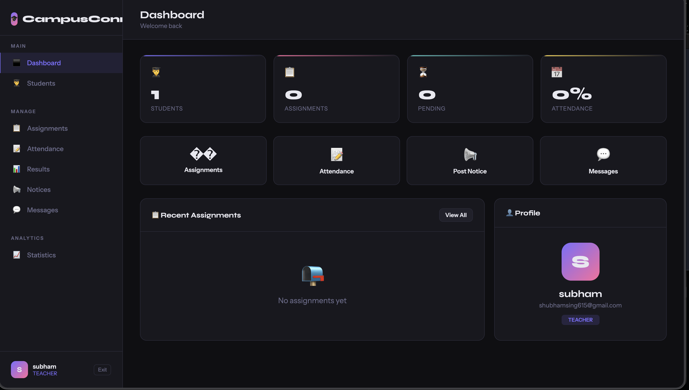
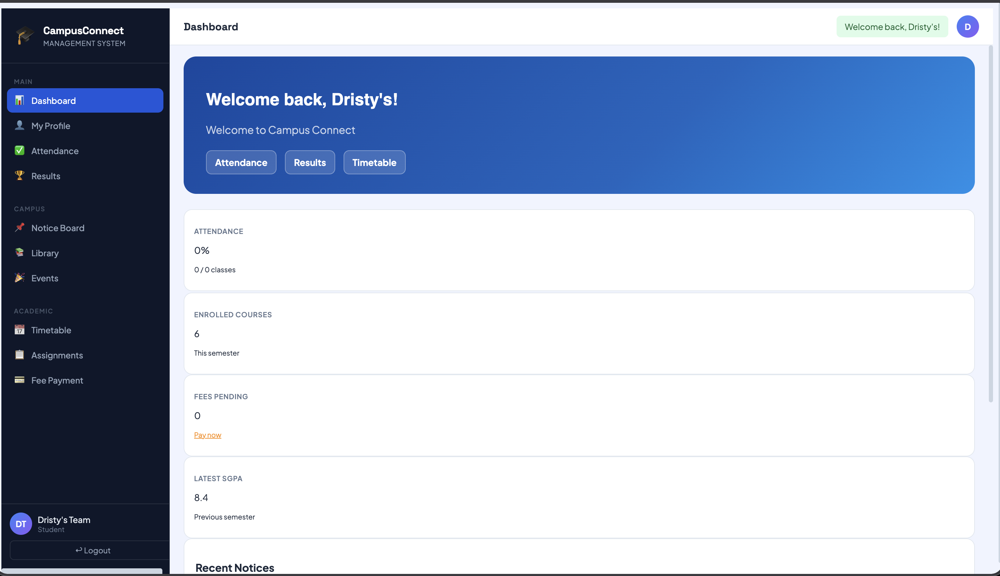

# 🎓 Campus Connect

A modern college management web application built using Flask and PostgreSQL.

## 🌐 Live Demo
https://mycampusconnect.duckdns.org

## 📌 Features

- 🔐 Student / Teacher / Admin Login
- 📊 Student Dashboard
- 📅 Attendance Management
- 📝 Results & Grades
- 💳 Fee Management
- 📚 Library Module
- 📢 Notices & Events
- 👨‍🏫 Teacher Dashboard
- 🛠️ Admin Panel
- 🔔 Real-time Notifications

## 🛠️ Tech Stack

- Backend: Python Flask
- Database: PostgreSQL
- Frontend: HTML, CSS, JavaScript
- Server: AWS EC2
- Web Server: Nginx + Gunicorn

## 🚀 Deployment

Hosted on AWS EC2 with HTTPS SSL security.

## 📷 Screenshots

(Add screenshots here)

## 👨‍💻 Developed By

Dristy Pal
## 📷 Screenshots

### Login Page

### Student Dashboard

### Teacher Dashboard

### Dashboard

